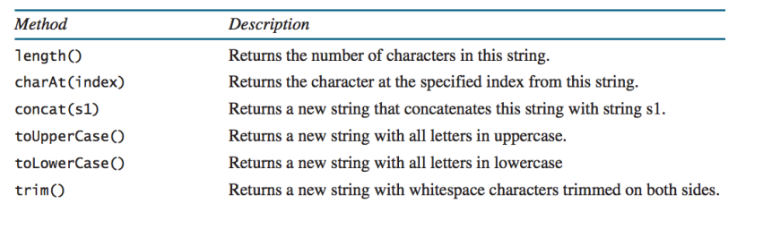
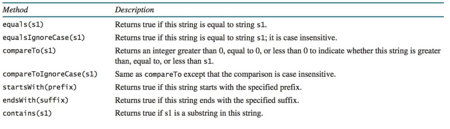

# String (chuỗi) 
## Định nghĩa: 
Là tập hợp các ký tự , hằng chuỗi bao gồm một hoặc nhiều ký tự
## Các phương thức xử lý chuỗi

### Trong đó: 
### + length() : độ dài của chuỗi (số ký tự trong chuỗi bao gồm khoảng cách)
### + charAt(index) : trả về ký tự trong chuỗi dựa vào vị trí index 
### + concat((String) a) : gộp 2 chuỗi vào với nhau
### + toUpperCase() : đổi toàn bộ thành chữ in hoa
### + toLowerCase() : đổi toàn bộ thành chữ thường
### + trim() : trả về chuỗi mới khi đã loại bỏ khoảng trắng trong chuỗi ở 2 đầu chuỗi

## So sánh chuỗi

### Trong đó:
### - equals() : Trả về true/false nếu 2 String bằng nhau
### - equalsIgnoreCase() : Trả về true/false nếu 2 String bằng nhau nhưng ko phân biệt chữ hoa chữ thường
### - s1.compareTo(s2) :(Dựa trên giá trị Unicode) Trả về >0 nếu chuỗi s1 "lớn" chuỗi s2; Trả về 0 nếu s1 "bằng" s2; Trả về <0 nếu s1 "nhỏ" s2
### - s1.compareToIgnoreCase(s2) : Tương tự compareTo() những bỏ qua so sánh chữ hoa or thường
### - startWith() : Trả về true/false nếu chuỗi bắt đầu bằng ký tự truyền vào 
### - endWith() : Trả về true/false nếu chuỗi kết thúc bằng ký tự truyền vào 
### - contains(a) : Trả về true/false nếu trong chuỗi có ký tự a
